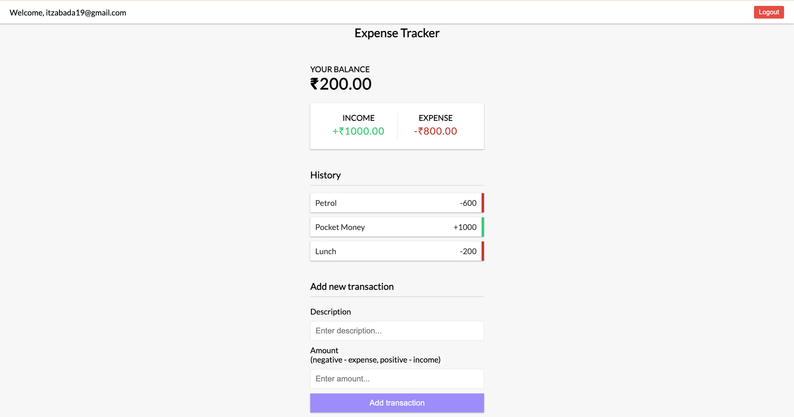

# Full-Stack Subscription & Bill Reminder Hub

A real-time, full-stack web application built with Vanilla JavaScript and a Firebase backend. This project allows users to securely sign up, log in, and manage their recurring subscriptions and bills. It features a cloud database, data visualization, and a fully automated backend function that sends email reminders for upcoming payments.



## 🚀 Live Demo

*[Link to your deployed app will go here! You can easily deploy this using Firebase Hosting.]*

## ✨ Core Features

* **Secure User Authentication:** Full signup, login, and logout functionality using **Firebase Authentication**.
* **Protected Routes:** Only authenticated users can access the main dashboard.
* **Cloud Database:** All subscription data is securely stored in **Firestore**, linked to the user's unique ID, and accessible from any device.
* **Full CRUD Functionality:** Users can **C**reate, **R**ead, **U**pdate (via a pop-up modal), and **D**elete their own subscriptions.
* **Real-time Data Syncing:** The UI updates instantly across all sessions when data is changed in the database, thanks to Firestore's `onSnapshot` listener.
* **Data Visualization:** A dynamic pie chart built with **Chart.js** provides a clean breakdown of monthly costs by category.
* **Backend Automation:** A **Firebase Cloud Function** runs on a schedule (every morning at 8 AM) to check for bills due in 3 days.
* **Automated Email Reminders:** The Cloud Function uses **SendGrid** to automatically send reminder emails to users for their upcoming bills.

## 🛠️ Tech Stack

### Frontend
* HTML5
* CSS3 (Flexbox & Grid)
* Vanilla JavaScript (ES6 Modules, Async/Await)
* Chart.js

### Backend (Backend-as-a-Service)
* **Firebase**
    * Firebase Authentication
    * Firestore Database
    * Firebase Cloud Functions
* **Node.js** (for the Cloud Functions environment)
* **SendGrid API** (for transactional emails)

## ⚙️ Getting Started

To run this project locally, you will need to set up your own Firebase project.

1.  **Clone the repository:**
    ```bash
    git clone [https://github.com/abdullah-habeeb/subscription-tracker.git](https://github.com/abdullah-habeeb/subscription-tracker.git)
    ```
2.  **Create your Firebase config file:**
    * In the `js/` directory, create a file named `firebase-config.js`.
    * Copy the contents of `js/firebase-config.example.js` and paste them into your new file.
    * Fill in the placeholder values with your own keys from your Firebase project's settings.
3.  **Run the application:**
    * This project uses JavaScript modules and requires a server. It is recommended to use a local server extension like **VS Code's Live Server**.
