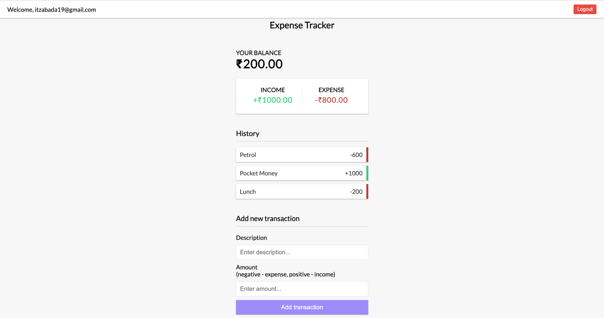

# 📱 Subscription Tracker

A full-stack web app to track subscriptions (Netflix, Spotify, etc.) — built with **Docker** and automated with a **Jenkins CI/CD pipeline**.



---

## 🧰 What You Need (Prerequisites)

Before anything, install these two tools:

| Tool | Download | Why You Need It |
|------|----------|-----------------|
| **Docker Desktop** | https://www.docker.com/products/docker-desktop/ | Runs the entire app in containers |
| **Git** | https://git-scm.com/downloads | To clone this repository |

> **After installing Docker Desktop**, open it and wait until the whale icon in your taskbar turns **green** (engine running). This can take 1–2 minutes.

---

## 🚀 Quick Start (Run in 2 Steps)

### Step 1 — Clone the project

```bash
git clone https://github.com/abdullah-habeeb/subscription-tracker.git
cd subscription-tracker
```

### Step 2 — Start the app

```bash
docker-compose up -d --build
```

That's it. Docker will build and start 3 containers automatically:

| Container | What It Does | URL |
|-----------|-------------|-----|
| **Backend** | REST API (Express.js) | http://localhost:5000 |
| **Frontend** | Dashboard UI (Nginx) | http://localhost |
| **Database** | PostgreSQL storage | localhost:5432 |

Open **http://localhost** in your browser to use the app. ✅

---

## ✅ Verify Everything is Working

Run this command to see all 3 containers:

```bash
docker ps
```

You should see 3 containers with `Up` status:
```
subscription-tracker-backend-dev    Up
subscription-tracker-frontend-dev   Up
subscription-tracker-postgres-dev   Up
```

Check the API is healthy:

```bash
# On Windows (PowerShell)
Invoke-RestMethod http://localhost:5000/health

# On Mac/Linux
curl http://localhost:5000/health
```

Expected response: `{ "status": "healthy", "timestamp": "..." }` ✅

---

## 🛑 Stop the App

```bash
docker-compose down
```

To also delete the database data:

```bash
docker-compose down -v
```

---

## 🤖 Jenkins CI/CD Pipeline

Jenkins automates the quality checks every time code is pushed. Run Jenkins inside Docker — no installation needed.

### Step 1 — Start Jenkins

```bash
docker run -d \
  --name jenkins \
  -p 8080:8080 \
  -p 50000:50000 \
  -v jenkins_home:/var/jenkins_home \
  jenkins/jenkins:lts-jdk17
```

Wait ~30 seconds, then open **http://localhost:8080**

### Step 2 — Unlock Jenkins

Get the one-time admin password:

```bash
docker exec jenkins cat /var/jenkins_home/secrets/initialAdminPassword
```

Paste that password into the Jenkins unlock page.

### Step 3 — Set Up Jenkins

1. Click **"Install suggested plugins"** and wait (~2 minutes)
2. On the "Create First Admin User" screen → click **"Skip and continue as admin"**
3. Click **"Save and Finish"** → **"Start using Jenkins"**

> Your login is now **username:** `admin` | **password:** the initial password you copied above.

### Step 4 — Create the Pipeline

1. Click **"New Item"**
2. Enter name: `subscription-tracker`
3. Select **Pipeline** → click **OK**
4. Scroll to the **Pipeline** section at the bottom
5. Set **Definition** → `Pipeline script from SCM`
6. Set **SCM** → `Git`
7. Set **Repository URL** → `https://github.com/abdullah-habeeb/subscription-tracker`
8. Under **Branches to build** → change `*/master` to **`*/main`**
9. Set **Script Path** → `.ci/jenkins/Jenkinsfile`
10. Click **Save**

### Step 5 — Run the Pipeline

Click **"Build Now"** — watch all 6 stages run automatically:

```
✅ Stage 1: SCM Checkout       — Pulls latest code from GitHub
✅ Stage 2: Code Analysis      — Scans source code structure
✅ Stage 3: Build Verification — Confirms all Dockerfiles exist
✅ Stage 4: Security Scan      — Checks for vulnerabilities
✅ Stage 5: Artifact Staging   — Prepares build artifacts
✅ Stage 6: Quality Metrics    — Reports on code quality
```

---

## 📂 Project Structure

```
subscription-tracker/
│
├── backend/src/server.js       ← Express.js REST API
├── index.html                  ← Frontend dashboard
├── login.html                  ← Login page
├── style.css                   ← Styling
│
├── .ci/docker/
│   ├── Dockerfile.dev          ← Development container (with hot-reload)
│   ├── Dockerfile.prod         ← Production container (optimized)
│   ├── Dockerfile.frontend     ← Nginx container for serving UI
│   └── nginx.conf              ← Routes /api/* to backend
│
├── .ci/jenkins/
│   └── Jenkinsfile             ← 6-stage CI/CD pipeline definition
│
├── docker-compose.yml          ← Runs all 3 services together
└── README.md                   ← This file
```

---

## 🔌 API Quick Reference

All API calls require the `x-user-id` header.

```bash
# Health check (no auth needed)
curl http://localhost:5000/health

# Get all your subscriptions
curl -H "x-user-id: user1" http://localhost:5000/api/subscriptions

# Add a subscription
curl -X POST http://localhost:5000/api/subscriptions \
  -H "x-user-id: user1" \
  -H "Content-Type: application/json" \
  -d '{"name":"Netflix","amount":499,"category":"Entertainment","billingCycle":"monthly","nextDueDate":"2026-07-01"}'

# Get spending report
curl -H "x-user-id: user1" http://localhost:5000/api/spending-report
```

---

## 🔧 Useful Commands

```bash
# See running containers
docker ps

# View live logs
docker-compose logs -f

# Backend logs only
docker logs -f subscription-tracker-backend-dev

# Restart everything
docker-compose restart

# Full clean reset
docker-compose down -v && docker-compose up -d --build
```

---

## ❓ Troubleshooting

| Problem | Fix |
|---------|-----|
| `docker-compose up` fails | Make sure Docker Desktop is open and engine is running (green icon) |
| `http://localhost` doesn't open | Run `docker ps` and check the `frontend` container shows `Up` |
| `http://localhost:5000/health` returns error | Check `docker logs subscription-tracker-backend-dev` |
| Jenkins shows `fatal: couldn't find remote ref refs/heads/master` | Change branch from `*/master` to `*/main` in Jenkins pipeline config |
| Jenkins password not working | Run: `docker exec jenkins cat /var/jenkins_home/secrets/initialAdminPassword` |
| Port 80 or 5000 already in use | Stop the conflicting app or change ports in `docker-compose.yml` |

---

## 🏗️ How It All Works Together

```
You push code to GitHub
        │
        ▼
Jenkins detects the push (or you click Build Now)
        │
        ▼
Jenkins runs the 6-stage pipeline (Jenkinsfile)
        │
        ▼
All checks pass → App is deployment-ready
        │
        ▼
Docker Compose runs 3 containers on your machine:
   ┌──────────┐   ┌──────────┐   ┌──────────┐
   │ Frontend │──▶│ Backend  │──▶│ Database │
   │  Nginx   │   │ Express  │   │ Postgres │
   │  :80     │   │  :5000   │   │  :5432   │
   └──────────┘   └──────────┘   └──────────┘
```

---

**Made by Abdullah** | For educational DevOps demonstration purposes
